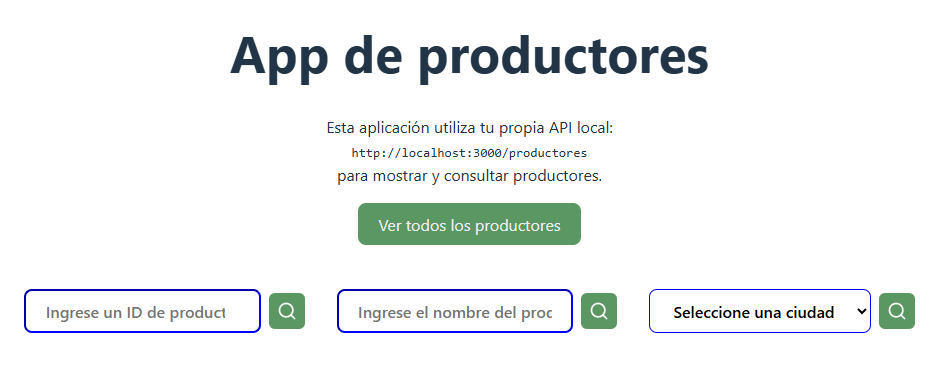

# API Search Placeholder 🔍

Aplicación creada con React + Redux Toolkit para buscar usuarios usando la API [JSONPlaceholder](https://jsonplaceholder.typicode.com/).

## 🌐 Demo en vivo

👉 [Haz clic aquí para ver la app funcionando](https://registro-de-usuarios-hooks-l6ru53wzq-danielguadirs-projects.vercel.app/)

